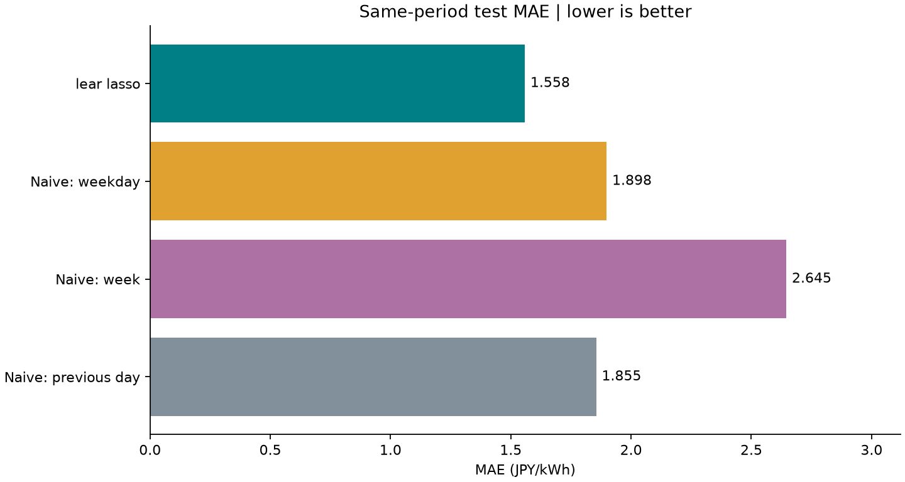
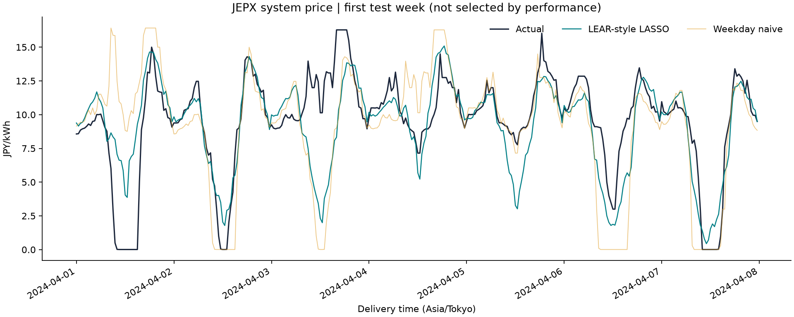
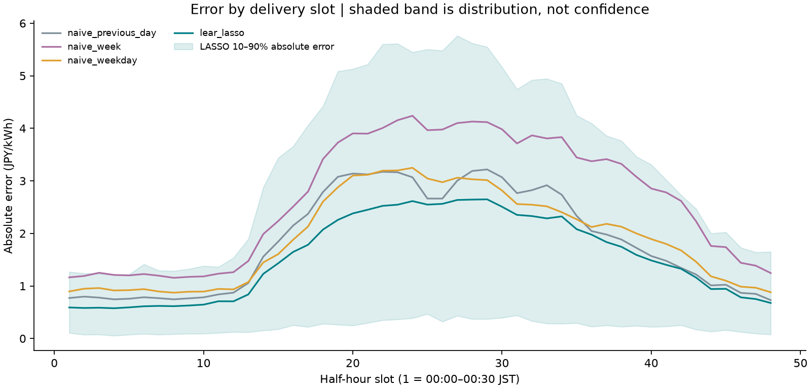
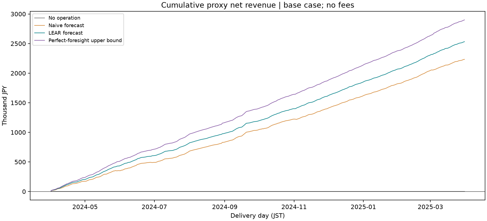

# JEPX Electricity Price Forecasting from Academic Literature

**Two-stage research portfolio:** Stage 1 — JEPX electricity price forecasting;
Stage 2 — forecast-driven battery scheduling and optimization.
The unchanged forecasts now feed a constrained MILP, followed by actual-price
out-of-sample valuation. [Battery method](docs/BATTERY_OPTIMIZATION.md) ·
[Executed battery results](docs/BATTERY_RESULTS.md).


[日本語](README.ja.md) · [Methodology](docs/METHODOLOGY.md) · [Results](docs/RESULTS.md) · [Paper notes](docs/PAPER_NOTES.md)

[](https://github.com/Fuku1121/jepx-electricity-price-forecasting/actions/workflows/tests.yml)

An independent, AI-assisted Python study adapting ideas from **Lago et al. (2021)**
to **JEPX half-hourly system prices**. It implements three naive baselines and a
48-output LEAR-style LASSO, with chronological validation, daily recalibration,
and tests against future leakage. **This is a simplified adaptation, not a paper reproduction.**

**Executed:** official JEPX fiscal 2022–2024 data; test delivery dates
2024-04-01–2025-03-31. **Local software checks: 25 tests passed.**

| Model | MAE (JPY/kWh) | RMSE (JPY/kWh) | rMAE (weekly) |
|---|---:|---:|---:|
| naive_previous_day | 1.8547 | 2.9903 | 0.7011 |
| naive_week | 2.6453 | 3.9525 | 1.0000 |
| naive_weekday | 1.8981 | 2.9987 | 0.7175 |
| lear_lasso | 1.5581 | 2.2918 | 0.5890 |

The LEAR-style model reduced MAE by **0.2967 JPY/kWh (16.00%)** against the strongest tested naive baseline, previous-day persistence. This is a descriptive result for one test year,
not evidence of statistical significance, general superiority or trading profitability.



## Review guide

| To review | Start here |
|---|---|
| Research question and measured outcome (Japanese) | [日本語の概要](README.ja.md) |
| Paper interpretation and deliberate simplifications | [Paper notes](docs/PAPER_NOTES.md) |
| Forecast timing, splits and leakage safeguards | [Methodology](docs/METHODOLOGY.md) |
| Full comparison, failure cases and evidence | [Results](docs/RESULTS.md) |
| Implementation and tests | [Source](src/jepx_forecasting/) · [Tests](tests/) |
| Reproduce the experiment | [Instructions below](#reproduction) · [Data acquisition](data/README.md) |

Study materials and the Japanese delivery report are indexed in [docs/README.md](docs/README.md).

## Motivation

The paper emphasizes fair comparisons and reproducible evaluation, making it a useful
starting point for connecting academic methods to a different electricity market.
This project focuses on the complete research workflow: literature interpretation,
information availability, data validation, independent implementation, and honest reporting.

## Paper

Lago, J., Marcjasz, G., De Schutter, B., & Weron, R. (2021).
*Forecasting day-ahead electricity prices: A review of state-of-the-art algorithms,
best practices and an open-access benchmark*. Applied Energy, 293, 116983.
[DOI](https://doi.org/10.1016/j.apenergy.2021.116983) ·
[arXiv](https://arxiv.org/abs/2008.08004) ·
[published author-hosted PDF](https://jesuslago.com/wp-content/uploads/1-s2.0-S0306261921004529-main-1.pdf).

Read [Paper notes](docs/PAPER_NOTES.md) for section references and explicit
**Paper / This implementation** distinctions. No third-party forecasting repository source code was intentionally used as an implementation reference or copied during this project. scikit-learn supplies the optimizer;
data handling, feature design, evaluation and reporting are implemented here.

## What I implemented

The repository contains strict official-CSV ingestion, lagged daily feature generation,
chronological splits, training-only scaling, daily LASSO recalibration, validation-only
alpha selection, three baselines, aligned metrics, figures and provenance records.
Unit tests include current/future-target mutation, unknown-target inference,
training-scaler checks and complete pipeline execution. AI assistance is disclosed in the [authorship statement](#ai-assistance).

## Dataset

Source: **Japan Electric Power Exchange (JEPX)**,
[official spot market data](https://www.jepx.jp/electricpower/market-data/spot/).
Target: **system price / システムプライス(円/kWh)**, not Tokyo area price.

Fiscal-year CSVs cover 2022-04-01–2025-03-31: 1,096 complete days,
52,608 observations, 48 slots/day, JPY/kWh, Asia/Tokyo.
Duplicates, missing dates/slots and nonfinite prices cause errors rather than interpolation.
The first seven days supply lag history. Final historical archives are not as-of snapshots.

[Data instructions and use conditions](data/README.md) explain manual and optional
form-based downloads. Raw/processed series and full prediction outputs are Git-ignored;
JEPX data are not relicensed under MIT. Figures and the short sample are derived from
JEPX data; source attribution applies to every results artifact.

## Method

Naive models copy the previous day, previous week, or previous day on Tuesday–Friday
and previous week on Saturday–Monday. The LEAR-style variant estimates one regression
per half-hour slot using **StandardScaler + Lasso**, minimizing squared error plus
an L1 coefficient penalty. Output regressions are independent, with a shared alpha.

The full d−1 auction curve is assumed known before the auction for d because it was
priced on d−2. This is an auction-price assumption, not permission to use future actual
load or intraday prices. See [Methodology](docs/METHODOLOGY.md).

## Features

247 daily columns: full 48-slot curves from d−1, d−2 and d−7; seven-day per-slot
means and standard deviations using only d−7,...,d−1; seven weekday indicators.
Slot identity is implicit in the separate target regressions. Weekend is represented
by Saturday/Sunday indicators. No actual future prices, demand or generation are used.

## Evaluation

| Partition | Delivery dates | Days |
|---|---|---:|
| Initial usable training | 2022-04-08–2023-12-31 | 633 |
| Validation | 2024-01-01–2024-03-31 | 91 |
| Test | 2024-04-01–2025-03-31 | 365 |

The grid `[0.03, 0.1, 0.3, 1.0]` and dates were specified before test metrics.
Daily expanding-window validation selected **alpha = 0.1** by MAE.
Alpha is then fixed; scaling and coefficients are fitted anew each test day using
only earlier target dates. This sequential evaluation is not a fixed-origin annual
forecast. Earlier test-day auction outcomes may enter later daily fits.

All models share 17,520 test observations. MAE is primary,
RMSE is secondary, and rMAE uses the weekly naive error on the same test observations.
No random splitting, MAPE, post-hoc clipping or removal of difficult days is used.

## Results

The table above comes from [metrics.csv](results/metrics.csv).
[Detailed results](docs/RESULTS.md) include differences against every baseline and
limitations. [Run metadata](results/run_metadata.json), [validation scores](results/validation_scores.csv),
[daily fitting audit](results/fit_audit.csv) and [daily MAE](results/daily_mae.csv)
make the experiment traceable. The full predictions remain local; the committed
[first-week sample](results/predictions_sample.csv) alone cannot reproduce annual metrics.





LASSO was worse than the previous-day baseline on 156/365 individual days and
produced 54 forecasts below 0.01 JPY/kWh; these were retained without clipping.
See the documented failure cases before interpreting the annual average.

The shaded error band is a descriptive 10th–90th percentile range, not a confidence interval.

## Differences from the paper

| Paper | This implementation |
|---|---|
| Five European/US hourly markets | One Japanese market; half-hourly system prices |
| Price lags 1, 2, 3, 7 and external forecast curves | Lags 1, 2, 7; rolling statistics; no external forecasts |
| Robust scaling and asinh price transformation | Training-only StandardScaler on X; untransformed y |
| Daily LARS/AIC penalty selection and coordinate descent | Shared alpha selected once on chronological validation |
| Several fixed calibration windows and ensembles | One daily expanding window; optional rolling window |
| LEAR and DNN benchmarks, two-year tests, DM/GW comparisons | LASSO and naive models, one-year test, descriptive comparisons |

## Battery optimization

**Research question:** does LEAR-driven battery scheduling improve realized proxy
revenue over the strongest existing naive forecast, under identical constraints?
This decision layer reuses Stage 1 forecasts without changing model, split or results.

**Hypothetical research battery:** 1 MWh nameplate, 0.5 MW charge/discharge,
10–90% SOC, fixed 50% start/end each day, 95% efficiency each way (90.25% round trip).
This user-proposed teaching case makes units and loss/energy constraints explicit;
it is not a fitted real installation. The base case has zero degradation cost.

**Optimization:** a SciPy/HiGHS MILP maximizes forecast price × net discharge energy
minus optional grid-side throughput cost. It enforces SOC dynamics, capacity/output
bounds and a binary charge/discharge state. MW × 0.5 h × 1000 converts to kWh.
Plans use forecasts only and are frozen before actual-price settlement; the oracle
has a separate function. A failed solver raises, rather than silently producing results.

**Backtest:** all 365 original test days (2024-04-01–2025-03-31), 48 slots/day.
No-operation, previous-day naive, LEAR, and the explicitly infeasible oracle share
battery conditions. Naive was chosen from the existing Stage 1 MAE ranking at the
user's request; no battery-return selection or test-period battery tuning was done.

| Strategy | Annual proxy net revenue (JPY) | Negative days |
|---|---:|---:|
| No-operation | 0 | 0 |
| Naive forecast optimization | 2,233,270 | 8 |
| LEAR forecast optimization | 2,532,089 | 2 |
| Perfect-foresight upper bound | 2,899,726 | 0 |

LEAR exceeds Naive by **298,819 JPY (+13.38%)** in the base case, but earns less on
**112 days**. On **43 days**, its MAE is lower yet its revenue is also lower.
**Lower forecast error does not automatically imply higher operational value.**
Six predeclared cases (base, RTE 80/90/95%, throughput cost 1/3 JPY/kWh) are all
reported in [Battery results](docs/BATTERY_RESULTS.md), including losses.



This is a **JEPX system-price research proxy**; an actual battery may settle on area prices or different contracts. Grid fees, imbalance costs, market impact, bid acceptance, transmission constraints, capex and fixed operating costs are omitted. All planned volumes are assumed executable. Degradation is only a hypothetical linear throughput charge, not a lifetime model. Battery parameters are hypothetical. Perfect foresight is infeasible in practice. These revenues do **not** demonstrate commercial operation or profitability.

See [equations, assumptions and reproduction](docs/BATTERY_OPTIMIZATION.md).
After preparing the full Stage 1 prediction file, run:

```bash
python scripts/run_battery_backtest.py --predictions results/predictions_full.csv
```

## What I learned

The implemented checks illustrate why delivery time and information availability must
be distinguished, why scaling belongs inside each fit, and why simple baselines are
necessary. Mutation tests demonstrate the code's causal feature construction; they
cannot establish historical publication timestamps. LASSO makes a large lag set
manageable, but a selected coefficient is not a causal explanation. A measured error
difference does not by itself establish economic value. The [Japanese study notes](docs/INTERVIEW_NOTES.md) explain these concepts with examples.

## Reproduction

Python 3.11+; run from this repository's root. Commands use a virtual environment;
on Windows replace `source .venv/bin/activate` with `.venv\Scripts\Activate.ps1`.

```bash
python -m venv .venv
source .venv/bin/activate
python -m pip install -r requirements.txt
python -m pytest -q
# Optional automatic download; manual instructions are in data/README.md
python scripts/download_or_prepare_data.py --download-years 2022 2023 2024
python scripts/run_experiment.py
```

If CSVs are already present, run `python scripts/download_or_prepare_data.py` without
download arguments. The run script revalidates raw files and produces the result
CSVs/figures; it does not require the prepared daily.csv. A full run may take several
minutes depending on hardware. No credentials are required for public data.

For the recorded dependency versions, first install
`python -m pip install -r requirements-lock.txt`, then
`python -m pip install --no-deps -e .`. The lock records the Windows/Python
3.12.14 run; it is not a promise of bitwise equality on every platform.
Compare raw file hashes in metadata before expecting equal outputs.

To use a rolling window, supply `--window-days 365 --output results/rolling_local`.
That is a new experiment, not the published main result; review its artifacts and
redistribution policy separately before committing them. Defaults reproduce the main run.

## Repository structure

```text
src/jepx_forecasting/  data, features, splits, baseline, lear, metrics, pipeline
scripts/              optional download/prepare and experiment entry points
tests/                pytest checks using synthetic fixtures only
docs/                 paper, methodology, results, interview, future work, publishing
results/              executed metrics, audits, small sample and figures
data/                 instructions; ignored local raw and processed CSVs
.github/workflows/    push/PR tests and import checks
```

## Limitations

This is not a full LEAR reproduction or a production trading system. One test year
and one market do not establish stability across regimes. External forecasts, Japanese
holidays, robust target transformations, uncertainty estimates and significance tests
are absent. Expanding history can preserve outdated regimes. Shared alpha simplifies
slot-specific tuning. Archive revisions and original release timing are not reconstructed.
System price is not automatically an area's executable battery settlement price.
Stage 2 now implements the [battery scheduling experiment](docs/BATTERY_OPTIMIZATION.md);
[remaining future work](docs/FUTURE_WORK.md) concerns execution realism and uncertainty.

## AI assistance

Codex was used for literature interpretation support, implementation, code review,
testing and documentation. This is an AI-assisted implementation, not a claim of unaided authorship.
The author remains responsible for reviewing the paper interpretation, experimental
decisions, implementation and conclusions. Authorship does not imply endorsement
by the paper authors or JEPX.

## License

Original code and documentation: [MIT](LICENSE). JEPX source data and the cited
paper retain their own rights. See [pre-publication review](docs/RELEASE_REVIEW.md)
for data exclusions and provenance checks. The Tests link leads to the current hosted CI status.
