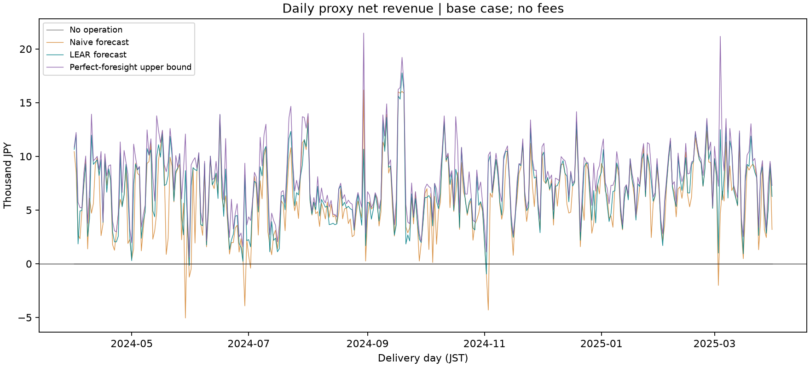
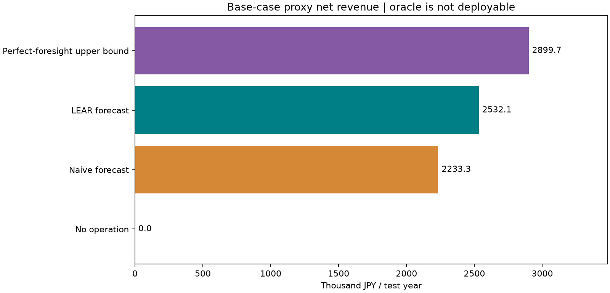
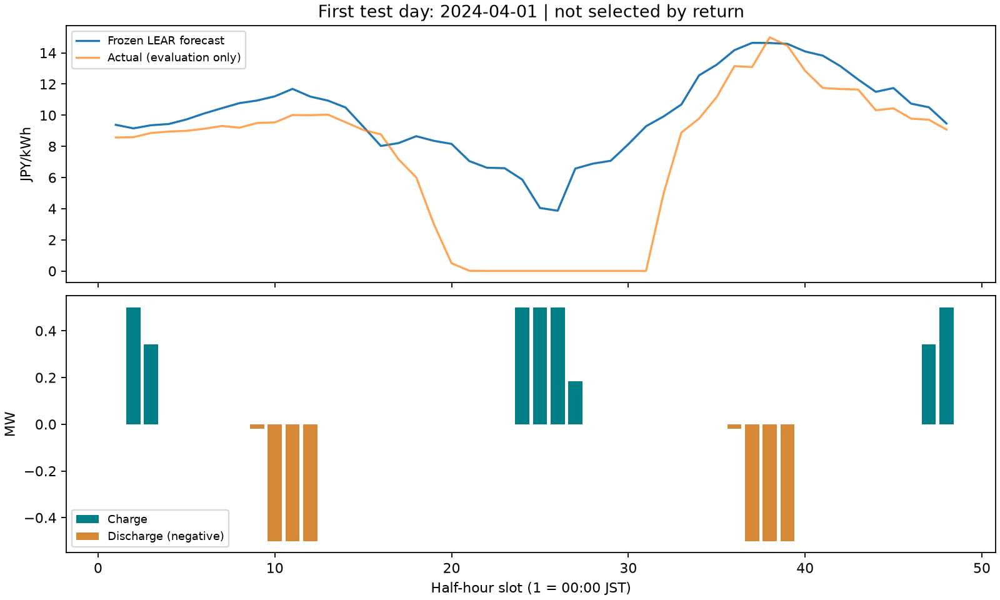
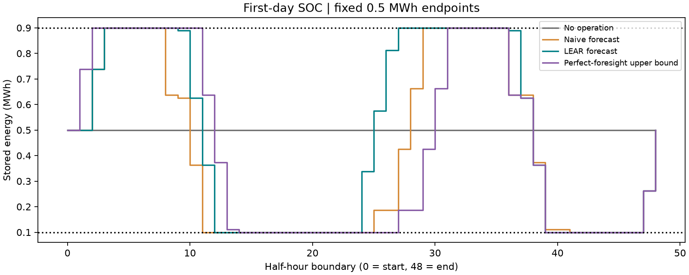

# Battery results / 蓄電池バックテスト結果

Executed on the unchanged Stage 1 test year, 2024-04-01–2025-03-31 (365 days).
Base case: 1 MWh, 0.5 MW, 10–90% SOC, initial/terminal 50%, 95% efficiency each way, zero throughput cost. All amounts below are JPY, rounded for display.

| Strategy | Annual proxy net revenue (JPY) | Negative days |
|---|---:|---:|
| No-operation | 0 | 0 |
| Naive forecast optimization | 2,233,270 | 8 |
| LEAR forecast optimization | 2,532,089 | 2 |
| Perfect-foresight upper bound | 2,899,726 | 0 |

The infeasible oracle has the highest cashflow. Among the forecast-driven methods,
LEAR leads by **298,819 JPY (+13.38%)**, and remains **367,636 JPY below the
perfect-foresight upper bound**. These are same-period descriptive differences,
not statistical significance or commercial profit claims.

## Downside and throughput / 損失と運転量

| Metric | Naive | LEAR | Oracle upper bound |
|---|---:|---:|---:|
| Average daily JPY | 6,118.55 | 6,937.23 | 7,944.45 |
| Median daily JPY | 6,033.36 | 6,947.07 | 7,826.51 |
| Daily standard deviation JPY (ddof=0) | 3,343.11 | 3,098.14 | 3,182.34 |
| Maximum daily profit JPY | 16,173.16 | 17,769.46 | 21,476.69 |
| Maximum daily loss JPY (signed) | -5,053.05 | -957.63 | 0.00 |
| Grid charged MWh | 566.38 | 551.35 | 566.46 |
| Grid discharged MWh | 511.16 | 497.60 | 511.23 |
| Charging intervals | 2,654.00 | 2,581.00 | 2,654.00 |
| Discharging intervals | 2,601.00 | 2,546.00 | 2,602.00 |

Naive loses money on **8 days**, with its worst day **2024-05-29: −5,053 JPY**.
LEAR loses on **2 days**, with its worst day **2024-11-02: −958 JPY**.
All negative days remain in the annual results. We have not investigated weather,
supply stress or other external causes and make no attribution to them.

## Forecast accuracy versus operational value

**Lower forecast error does not automatically imply higher operational value.**
Stage 1 MAE remains 1.558052 JPY/kWh for LEAR versus 1.854744 for previous-day naive.
The 16.00% MAE reduction accompanies a 13.38% annual cashflow increase in this
particular battery setup. It is not an identity between those percentages.

LEAR earns less than Naive on **112 of 365 days** and more on 253. On **43 days**,
LEAR has lower daily MAE yet lower daily revenue. LEAR leads in all 12 monthly
aggregates, while daily exceptions remain. The descriptive Pearson correlation
between daily MAE advantage (naive−LEAR) and daily revenue advantage (LEAR−naive)
is **0.4704**; no p-value, causality, independence assumption or inferential claim
is attached to that statistic.

MAE weights all slots equally. Revenue weights the prices at scheduled volumes,
with losses and SOC/output constraints coupling time slots. Errors in price order,
spreads and timing can change the chosen plan even if mean error improves.
予測の精度向上だけでは、意思決定の価値向上を保証できません。

## All predeclared sensitivity cases / 感度分析の全結果

One factor changes at a time. The cost cases reoptimize with that cost in the
objective. These are hypothetical values, not estimated degradation costs.
No case was selected after observing test returns; base remains the reference.

| Scenario | RTE | Cost JPY/kWh throughput | No-op JPY | Naive JPY | LEAR JPY | Oracle upper bound JPY |
|---|---:|---:|---:|---:|---:|---:|
| base | 90.25% | 0 | 0 | 2,233,270 | 2,532,089 | 2,899,726 |
| rte_80 | 80.00% | 0 | 0 | 1,559,953 | 1,858,224 | 2,186,937 |
| rte_90 | 90.00% | 0 | 0 | 2,213,350 | 2,514,521 | 2,881,165 |
| rte_95 | 95.00% | 0 | 0 | 2,586,421 | 2,857,954 | 3,277,898 |
| cost_1 | 90.25% | 1 | 0 | 1,397,446 | 1,664,677 | 1,996,344 |
| cost_3 | 90.25% | 3 | 0 | 288,673 | 475,749 | 828,854 |

LEAR's annual proxy cashflow exceeds Naive's in all six reported cases. The cost_3
case reduces LEAR net cashflow to about 476 thousand JPY; therefore the base-case
zero-cost number should not be presented as realized commercial profit. Efficiency
and cost assumptions materially change the reported economic magnitude.

## Evidence / 保存物

- [Strategy metrics](../results/battery/strategy_metrics.csv): all requested annual/day/energy/count statistics.
- [Daily revenue](../results/battery/daily_revenue.csv) and [monthly revenue](../results/battery/monthly_revenue.csv).
- [All sensitivity metrics](../results/battery/sensitivity_metrics.csv) and [daily sensitivity results](../results/battery/sensitivity_daily_revenue.csv).
- [First-week schedules](../results/battery/battery_schedules_sample.csv), [battery configurations](../results/battery/battery_config.json), [run metadata](../results/battery/battery_run_metadata.json).
- [Method and reproduction](BATTERY_OPTIMIZATION.md); [unchanged Stage 1 results](RESULTS.md).

Figures and derived results use JEPX official system-price data. JEPX source-data
rights and attribution remain applicable; these artifacts do not relicense them.
The full local base schedule's 70,080 rows were independently checked for power,
SOC, terminal conditions and simultaneous operation; all daily cashflows were
recomputed from the original actual prices. Maximum SOC dynamic residual was
below 1e−12 MWh, and simultaneous charge/discharge intervals were zero at 1e−6 MW
tolerance. Every sensitivity schedule is also validated by the runner.

## What follows, and what does not / 言えること・言えないこと

The executed experiment demonstrates a separation of forecasting, constrained
optimization and out-of-sample valuation. It demonstrates an economic ranking
for these frozen inputs and assumptions. It does not establish future stability,
causal effects, deployability or a profitable battery investment. Only one test
year and one market are used; baseline selection reused the Stage 1 test ranking.
Daily terminal equality prevents borrowing free energy but excludes interday
opportunities. Archive prices are not publication-time snapshots.

This is a **JEPX system-price research proxy**; an actual battery may settle on area prices or different contracts. Grid fees, imbalance costs, market impact, bid acceptance, transmission constraints, capex and fixed operating costs are omitted. All planned volumes are assumed executable. Degradation is only a hypothetical linear throughput charge, not a lifetime model. Battery parameters are hypothetical. Perfect foresight is infeasible in practice. These revenues do **not** demonstrate commercial operation or profitability.

JEPX system priceを用いた**研究用proxy**です。実設備はarea priceや別契約で決済される可能性があります。grid fees（系統料金）、imbalance costs、market impact、bid acceptance、transmission constraints、設備投資・固定運転費を考慮せず、全計画量の約定を仮定します。劣化コストは仮想の線形throughput費用で、寿命モデルではありません。電池条件も仮想設定です。Perfect foresightは実行不可能であり、この収益は商用運用・利益の証明ではありません。

AI assistance is disclosed; the portfolio owner must independently understand and verify these conclusions.
